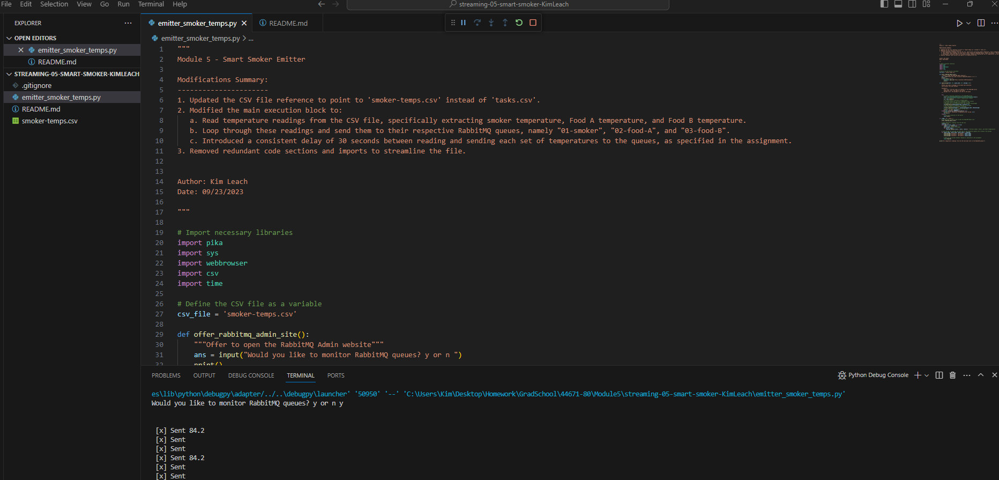
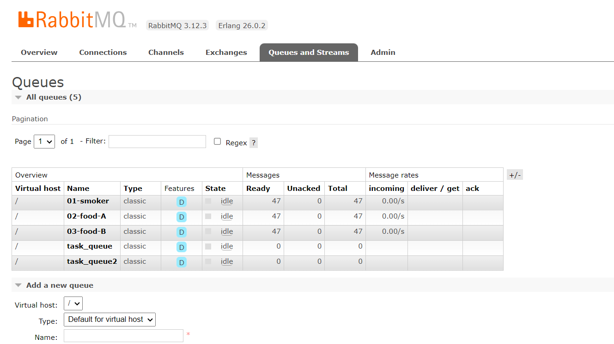

# streaming-05-smart-smoker-KimLeach

This project demonstrates the use of RabbitMQ to stream temperature readings from a smart smoker. The data is read from a CSV file, `smoker-temps.csv`, which contains temperature readings of the smoker and two types of food over time. Each reading is sent as a message to specific RabbitMQ queues.

## Features

- Reads temperature data from a CSV file.
- Streams data to RabbitMQ queues with a delay to simulate real-time streaming.
- Sends smoker temperature readings to "01-smoker" queue.
- Sends Food A temperature readings to "02-food-A" queue.
- Sends Food B temperature readings to "03-food-B" queue.

## Prerequisites

- RabbitMQ server running on `localhost`.
- `pika` Python package installed.

## Setup and Usage

1. Ensure RabbitMQ server is running.
2. Install the required Python packages.
3. Run the emitter_smoker_temps.py script
4. Monitor the RabbitMQ queues using the RabbitMQ Admin site

## Modifying the Emitter

- The emitter script, emitter_smoker_temps.py, can be modified to read data from different CSV files or to send data to different RabbitMQ queues. Refer to the comments in the script for guidance.

## Acknowledgements

- The project structure and approach are based on the lessons and examples from Module 4 and Module 5.

## Screenshots

### Emitter in Visual Studio Code

### RabbitMQ Queue

